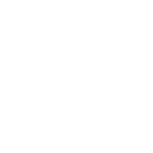
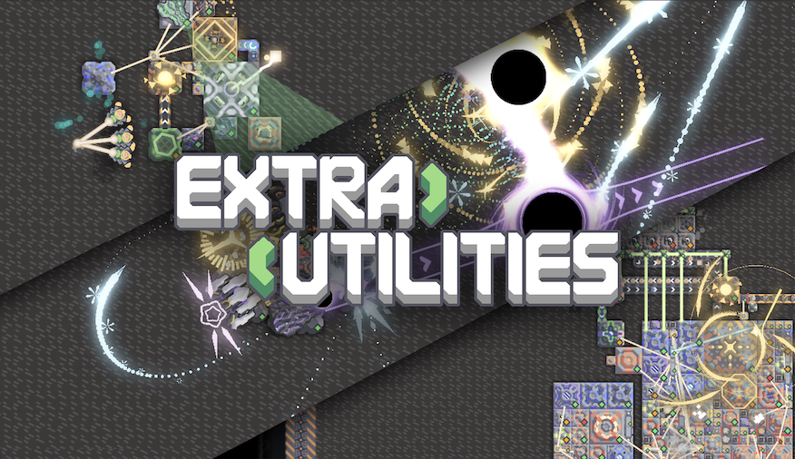

# ExtraUtilities
## Mindustry 扩展模组 · 官方文档库

新手辅助，高阶单位，高阶炮塔，高阶工厂，视觉调整 | 轻量化高兼容模组

<a href="https://github.com/guiYMOU/mindustry-Extra-Utilities-mod/releases" style="color:var(--main-color); border:2px solid var(--main-color); padding:8px 20px; border-radius:5px; text-decoration:none; display:flex; align-items:center; gap:10px;">
 更新日志&获取模组
</a>

---

##  模组介绍
ExtraUtilities 给予原版游戏上的体验扩展：

- 高级单位工厂炮塔
- 全新战役地图玩法
- 辅助设置优化游戏体验
- 神秘机制以及作者的小巧思

> 本文档收录全部建筑、物品、单位数值和具体机制。

---

##  全分类导航

<h3 style="margin:0 0 12px 0; display:flex; align-items:center; gap:8px;">
建筑图鉴
</h3>

全部建筑数值机制&部分演示

<a href="./building/main/">进入建筑分类 →</a>

<h3 style="margin:0 0 12px 0; display:flex; align-items:center; gap:8px;">
资源物品
</h3>

EU全部物品展示（WTMF）

<a href="./item/">查看全部物品 →</a>

<h3 style="margin:0 0 12px 0; display:flex; align-items:center; gap:8px;">
作战单位
</h3>

全部单位属性以及部分攻击效果动图演示

<a href="./unit/">单位详情页 →</a>

<h3 style="margin:0 0 12px 0; display:flex; align-items:center; gap:8px;">
状态效果
</h3>

EU部分特殊效果一览

<a href="./mechanism/">效果详解 →</a>

<h3 style="margin:0 0 12px 0; display:flex; align-items:center; gap:8px;">
战役地图
</h3>

EU新增地图战役（可能剧透）

<a href="./mechanism/">地图一览 →</a>

<h3 style="margin:0 0 12px 0; display:flex; align-items:center; gap:8px;">
设置讲解
</h3>

EU全部设置和功能介绍

<a href="./mechanism/">设置功能 →</a>

<h3 style="margin:0 0 12px 0; display:flex; align-items:center; gap:8px;">
独立模式
</h3>

EU肉鸽模式介绍

<a href="./mechanism/">肉鸽模式 →</a>

<h3 style="margin:0 0 12px 0; display:flex; align-items:center; gap:8px;">
更新日志
</h3>

版本新增内容、平衡调整、BUG修复记录

<a href="./changelog.md">查看更新 →</a>

<h3 style="margin:0 0 12px 0; display:flex; align-items:center; gap:8px;">
常见问题
</h3>

安装冲突、崩溃报错、玩法疑问解答

<a href="./faq.md">问题汇总 →</a>

---

---

##  文档维护
- 开源仓库：<a href="https://github.com/guiYMOU/ExtraUtilitiesWiki">→ 前往仓库 ←</a>
- 数值错误、缺失内容欢迎提交 Issues 补充修正